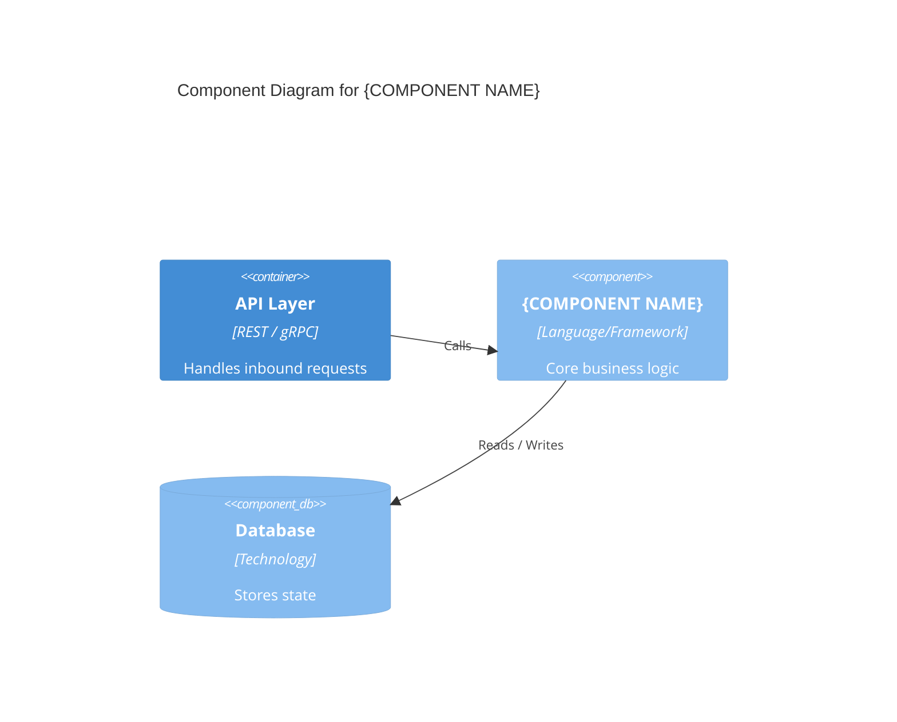

# Component Design: {COMPONENT NAME}

- **Date:** YYYY-MM-DD
- **Version:** 1.0
- **Author(s):** <!-- GitHub handles or names -->
- **Owning Team:** <!-- team name -->
- **DocType:** component-design
- **Tags:** <!-- comma-separated labels -->

---

## Overview

<!-- Two or three sentences describing what this component does and why it exists. -->

## Responsibilities

- <!-- primary responsibility 1 -->
- <!-- primary responsibility 2 -->

## Non-Responsibilities

- <!-- what this component deliberately does NOT do -->

## Component Diagram

<!-- C4 Component-level diagram using Mermaid, or link to an image. -->

## Interfaces

### Inbound

| Interface | Protocol | Contract | Notes |
|-----------|----------|----------|-------|
| <!-- interface name --> | <!-- HTTP / gRPC / event --> | <!-- link to spec --> | |

### Outbound

| Interface | Protocol | Contract | Notes |
|-----------|----------|----------|-------|
| <!-- dependency name --> | <!-- protocol --> | <!-- link to spec --> | |

## Data Model

<!-- Describe the key entities managed by this component.
     Embed an ER diagram or table of fields. -->

## Error Handling

<!-- Describe how errors are categorised, logged, and surfaced to callers. -->

## Security

<!-- Document authentication/authorisation requirements, data classification,
     secrets management, and any relevant threat model. -->

## Observability

| Signal | Tool / Location | SLI / Alert Threshold |
|--------|-----------------|----------------------|
| Metrics | <!-- e.g. Prometheus / Grafana --> | <!-- e.g. error_rate > 1% --> |
| Logs | <!-- e.g. Loki / Splunk --> | <!-- log level, retention --> |
| Traces | <!-- e.g. Jaeger / OpenTelemetry --> | <!-- sampling rate --> |

## Deployment

<!-- Container image, Helm chart or deployment unit, scaling strategy, resource limits. -->

## Related Documents

- <!-- System Context, ADRs, RFCs that are relevant to this component -->
