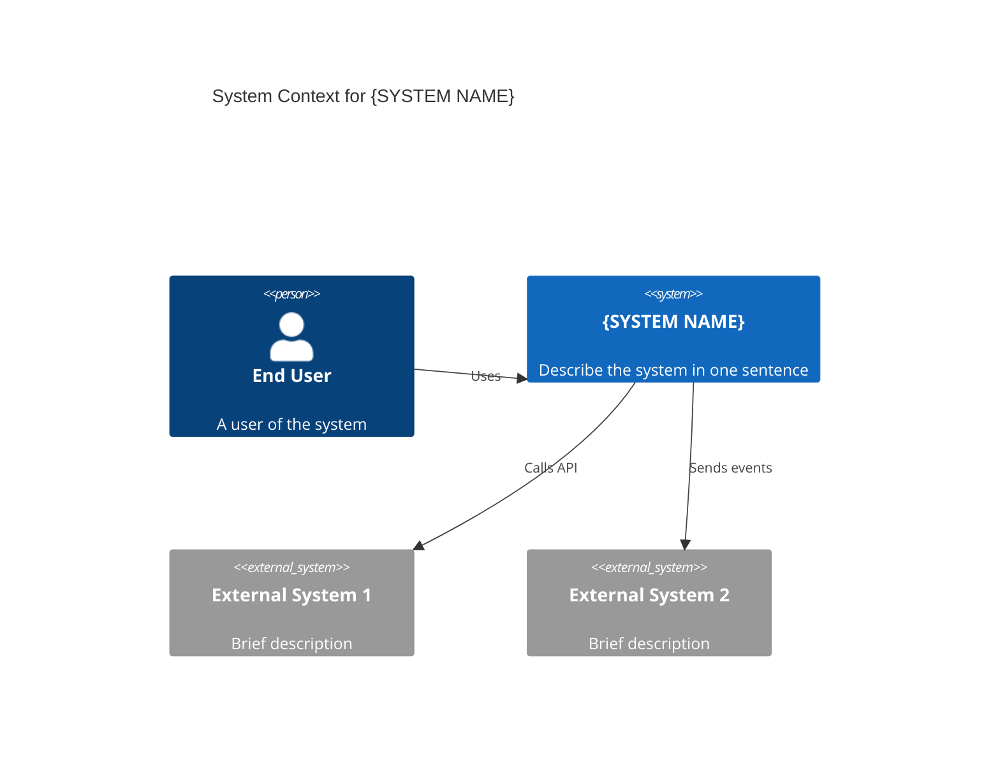

# System Context: {SYSTEM NAME}

- **Date:** YYYY-MM-DD
- **Version:** 1.0
- **Author(s):** <!-- GitHub handles or names -->
- **DocType:** system-context
- **Tags:** <!-- comma-separated labels, e.g. core-system, data-platform -->

---

## Purpose

<!-- One paragraph: what is this system and what business capability does it fulfil? -->

## System Boundary

<!-- Describe what is inside and outside the system boundary. -->

### In Scope

- <!-- capability or component that belongs to this system -->

### Out of Scope

- <!-- capability or concern explicitly excluded from this system -->

## Context Diagram

<!-- Embed or link to a C4 Context diagram.
     Use the Mermaid block below as a starting point, or replace with an image link. -->

## External Actors

| Actor | Type | Interaction | Notes |
|-------|------|-------------|-------|
| <!-- actor name --> | `Person` \| `System` \| `Service` | <!-- how they interact --> | |

## Key Constraints

<!-- List any significant constraints that shape the system design:
     regulatory requirements, existing infrastructure, SLAs, etc. -->

- <!-- constraint 1 -->
- <!-- constraint 2 -->

## Quality Attributes

| Attribute | Target | Current Baseline |
|-----------|--------|-----------------|
| Availability | <!-- e.g. 99.9% --> | |
| Latency (p99) | <!-- e.g. < 500 ms --> | |
| Throughput | <!-- e.g. 1,000 req/s --> | |
| RPO | <!-- Recovery Point Objective --> | |
| RTO | <!-- Recovery Time Objective --> | |

## Related Documents

- <!-- ADRs, RFCs, component designs that belong to this system -->
